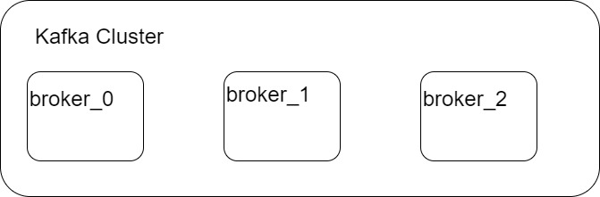
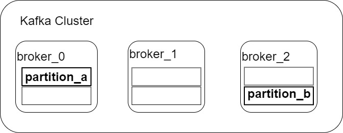
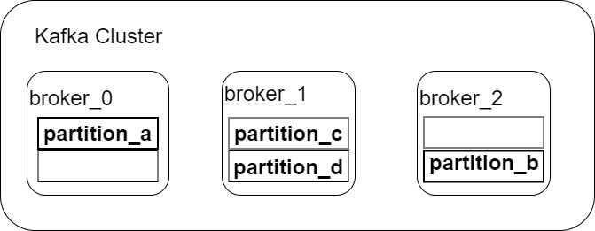

# Brokers and Topics

## Kafka Clustering

All Kafka brokers belong to a Kafka cluster. A cluster consists of one or more Kafka brokers. Some clusters may contain just one broker or others may contain three or potentially hundreds of brokers. Companies like Netflix and Uber run hundreds or thousands of Kafka brokers to handle their data.

A client that wants to send or receive messages from the Kafka cluster may connect to any broker in the cluster. This broker is called the bootstrap server. The bootstrap server returns metadata to the client that consists of a list of all the brokers in the cluster. The client then connects to one of the brokers from the list. This way a client does not have to know all the brokers.

> Key Takeways
>
> * Kafka servers are referred to as _**brokers**_
> * All the _brokers _that work together are referred to as a _**cluster**_
> * Clusters may consist of just one broker, or thousands of brokers
> * Each broker identified by a numeric id

## Kafka Topics

Kafka uses _**topics**_ to organize and segment related events. Topics are analogous to SQL Tables. However, unlike SQL Tables, Kafka topics are not queryable. Instead, we must create producers and consumers to utilize data. For example, we may have a topic - **logs** to store logs from our application and another topic - **purchases** to contain all purchase data for our application.

Topics may be created automatically, programmatically, or from the command line. All topics consist of a stream of key-value data in binary format.

> Key Takeaways
>
> * Used to organize and segment datasets, similar to SQL database tables
> * Unlike SQL database tables, Kafka Topics are not queryable
> * It may be created programmatically, from a CLI (Command Line Interface), or automatically
> * Consist of key-value data in binary format

## Brokers and topics

Kafka stores all of its data in a directory on the broker disk. Each topic receives its own sub-directory with the associated name of the topic. Kafka may use one or more log files for a given topic.

To achieve high throughput and scalability on topics, Kafka supports partitioning. When a Kafka topic is partitioned, the topic log is split or partitioned into multiple files. Each of these files represents a partition. If there are multiple Kafka brokers in a cluster, the partitions will typically be distributed among the brokers evenly.

In the diagram above, a single topic has two partitions - _partition\_a _and _partition\_b_.  There are three brokers in the cluster. In this case, _broker\_1_ does not contain any partition. Alternatively, there may be more partitions of a topic than the number of brokers in the cluster. In that case, one broker will contain more than one partition of the topic.&#x20;

There is no relationship between broker ID and the partition ID - Kafka does a good job of distributing partitions evenly among the available brokers.

> Key Takeaways
>
> * All Kafka topics consist of one or more partitions
> * A partition contains a strictly-ordered subset of all the data in the Topic
> * Partitions enable Kafka to achieve high throughput
